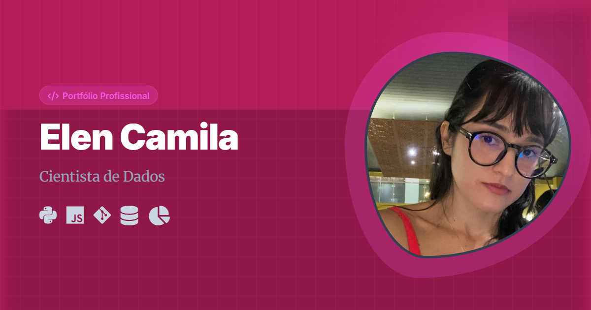

# Gerador de Thumbnail Personalizável

[](https://samuel-c-santos.github.io/gerador-de-thumbnail/)
[](LICENSE)

Uma ferramenta web simples e poderosa para criar capas de perfil (LinkedIn, Twitter/X) e imagens de pré-visualização (Open Graph) personalizadas, focada em desenvolvedores e profissionais de dados.

🔗 **Acesse a ferramenta online:** [https://samuel-c-santos.github.io/gerador-de-thumbnail/](https://samuel-c-santos.github.io/gerador-de-thumbnail/)

## Funcionalidades

* **Renderização em Tempo Real:** Visualização imediata das alterações (1200x630px).
* **Recorte de Imagem Integrado:** Upload e ajuste de foto de perfil com zoom e crop (via `Cropper.js`).
* **Personalização Completa:**
    * Edição de Título e Subtítulo.
    * Seletor de Cores (Fundo e Destaque/Accent) com geração automática de gradientes.
    * Seleção de Tecnologias (Ícones FontAwesome).
* **Download Instantâneo:** Gera um arquivo PNG de alta qualidade pronto para uso.
* **Privacidade:** Todo o processamento é feito no navegador do cliente (Client-side).

## Exemplos Gerados

Aqui estão alguns exemplos criados com a ferramenta:

| Perfil Dev (Samuel) | Variação de Cor | Perfil Profissional (Elen) |
|:---:|:---:|:---:|
|  |  |  |

## Tecnologias Utilizadas

* **HTML5 & CSS3** (Variáveis CSS para temas dinâmicos)
* **JavaScript (ES6+)**
* **[html2canvas](https://html2canvas.hertzen.com/)**: Para renderizar o DOM como imagem.
* **[Cropper.js](https://github.com/fengyuanchen/cropperjs)**: Para manipulação e recorte de imagens.
* **FontAwesome**: Biblioteca de ícones.

## Como usar localmente

1. Clone o repositório:
   ```bash
   git clone [https://github.com/samuel-c-santos/gerador-de-thumbnail.git](https://github.com/samuel-c-santos/gerador-de-thumbnail.git)